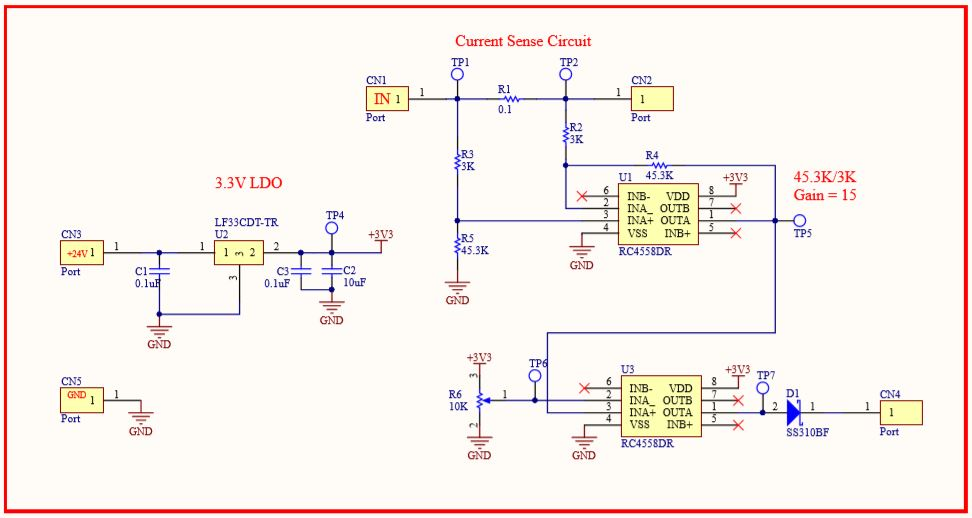
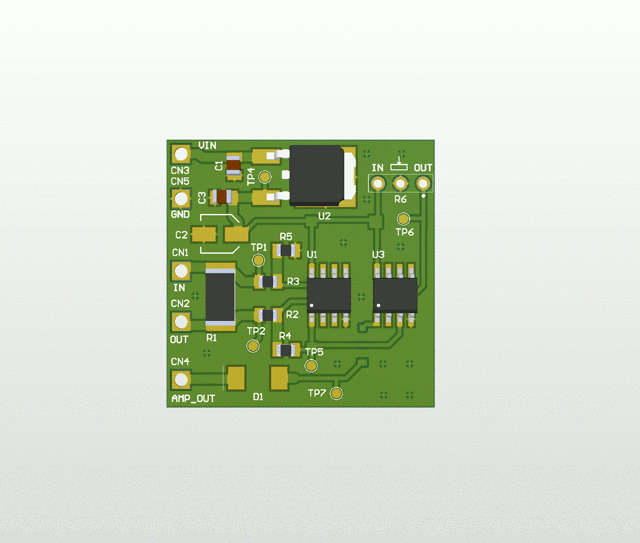
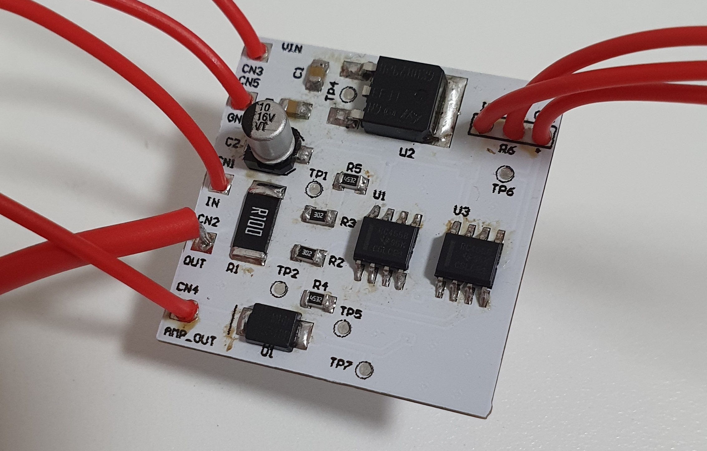
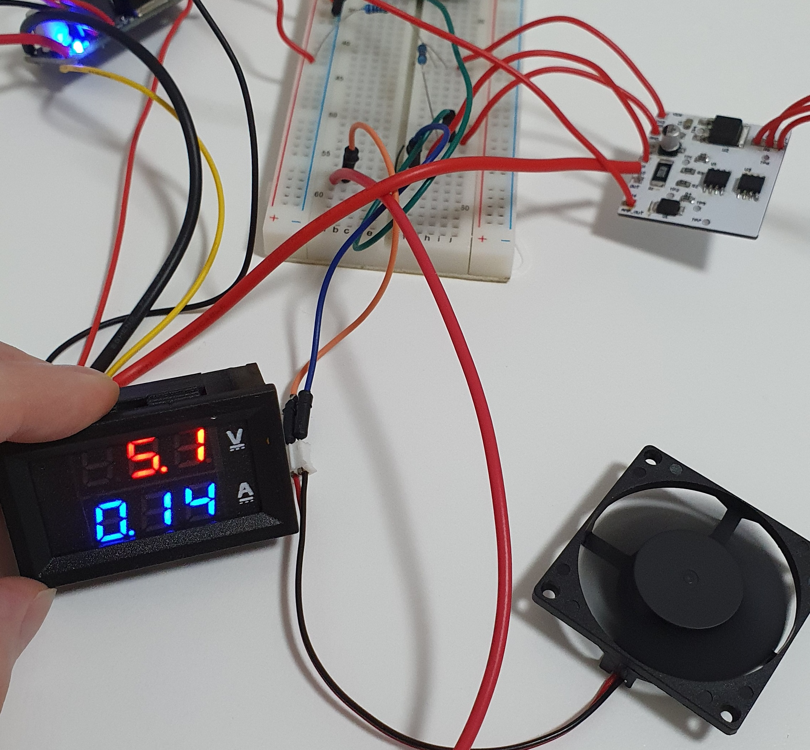

# Current_Sense_Amplifier-Feedback  (Completed)
A current shunt amplifier circuit to provide feedback for other circuits. 
## Goal:
Develop a current feeback system via current shunt and a amplifier cicuit.
It can be connect to any external circuit.
The specific use of this project is to provide a current feedback to a powerr supply unit to allow limiting current function.

## Requirments:
1. Provie a current feeback proportional to the voltage. (1A = 1V)
2. Acceptable voltage drop accross the current shunt. (0.2V MAX with 2A current)
## Implementation:
## Schematic:
 
## PCB:
 
## Product and testing:
Actual PCB:

Working condition:
 
Testing:
After powering up the circuit, a few checks is performed.
1. LDO output = 3.3V (Checked,OK)
2. Voltage drop over the current shunt is correct (Checked,OK)
3. Amplification over the op-amp is correct (Checked,OK, however is slightly large then the calculated 15X)
4. Comparator works (Checked,OK, Output changes then V+ is small then V-)
5. Potentiometeris able to tune the voltage into the comparator from 0-3.3V (Checked,OK)
6. Output voltage is correct (Checked,OK)
 ## Conclusion
 Overall the circuit is working fine as intented. 
 Only changes to the design is the amplification over the op-amp is slightly larger then calculated, but it will still work. 
 This circuit can be used for limtiing the current in a buck converter IC such as the LM2596. 
 The output of this circuit will be connected to the feedback pin of the buck converter, so the current becomes the dominating domain. 
 When the reference voltage of the buck converter is higher then this circuit's output, it will lower the switching frequency to reduce  the volagte, vice versa if the voltage is lower. 
 Tested with my LM2596, it is able to limited the current by lowering the voltage.
 This is circuit will add current limiting features as a feedback circuit, it will be used in my PSU project and maybe other projects in the future.
 
